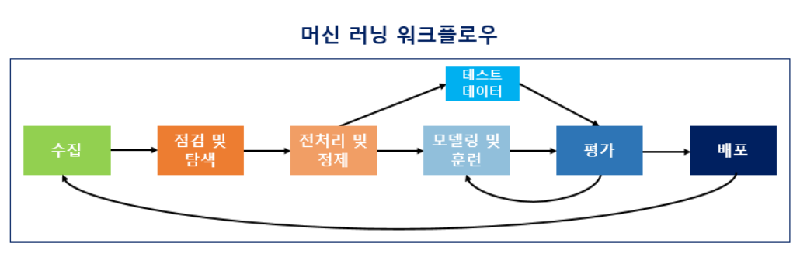

# 데이터 전처리 들어가기

데이터 분석과 활용을 시작하기 전에 데이터 전처리에 대한 기본적인 개념과 순서를 이해합니다. 

 

### 데이터(Data)

-> 엄청 많은 종류의 데이터 중에서 분석 목적에 맞는 데이터를 수집하고 활용하는 것이 중요

정형 데이터
-> 수치로 표현 가능, 저장 검색 분석에 용이

비정형 데이터
-> 언어 문자 등, 많은 비용과 기술적 투자가 수반

### 어떤식으로 활용하는지

-> 공장

기계 고장을 미리 예측하고 사고를 줄이기 위해서 진동이나 떨림 등 각종 센서로 부터 받은 데이터를 처리, 분석해서 고장이 나기 전 미리 수리 혹은 교체

-> 은행

적금, 예금 상품 계약 및 신규 상품 추진을 위해  계약률이 높은 사람에게 상품 추천

카드 사용자의 소비 행동 패턴을 분석해 최적화 된 카드 혜택 및 맟춤형 정보 제공

-> 커피 체인점

다른 커피 매장의 위치, 교통 패턴, 지역 인구 통계, 소득수준, 경쟁사 등 다량의 데이터를 수집해 이를 분석하여 최상의 입점 위치를 찾음

신규 매장에 의해 기존의 매장이 얼마나 타격을 입을 지 예상

구매 이력 데이터를 수집하여 매장 정보, 날씨, 커피 취향, 방문 예상 시간 예측, 취향에 맞는 신메뉴 추천 -> 구매 확률 37%

### 데이터 전처리를 왜 해야 하는지

-> 머신러닝 알고리즘에 적용하기 위해서 필요한 데이터를 마땅한 형식으로 분석 처리 하는 것

### 데이터 전처리 과정

CRISP-DM 데이터마이닝 분석 방법론

-> 비즈니스 이해 -> 데이터 이해 -> 데이터 준비 -> 모델 작성 -> 평가 -> 배포/공유

머신 러닝 워크플로우

-> 문제 이해 및 목표 설정 -> 데이터 수집 -> 점검 및 탐색 -> 데이터 정제 -> 모델링 및 훈련 -> 평가 -> 배포

-> 데이터 추출 -> 데이터 준비(데이터 처리 및 랭귤링, 특성 추출 및 엔지니어링, 특성 스케일링 및 선택) -> 모델링 -> 모델 평가 튜닝 -> 배포 및 모니터링

#### 문제 이해(정의) 및 목표 설정

문제를 정의하고 접근 하는 것이 중요

문제 해결을 위한 좋은 해결책이 맞는지

목표를 정하고 문제 해결 성공 여부를 판단하는 기준을 미리 파악

해당 목표의 비지니스의 목적과 함께 분석 목표화 성공 기준 정의

해결할 문제가 잘 정의되어 있는지

사용하려는 데이터와 이 데이터가 왜 필요한지 정의하는 것이 중요

진행하려는 방법이 문제에 가장 좋은 해결책이 맞는지

#### 데이터 수집

기계에 학습을 시킬 데이터가 필요

다른 특성을 기반으로 추론(예측) 할 수 있는 속성이 포함 되있는지 확인

표 형식으로 표현할 수 있는 정형 데이터, 그렇지 않은 비정형 데이터의 처리 방법이 다름

#### 데이터 점검 및 탐색

데이터를 탐색하고 분석

데이터 타입, 크기 등을 점검

데이터의 특징과 구조적 관계 파악 및 흥미로운 통찰을 통해 더 깊게 이해

시각화를 통해 간단한 통계

트랜드, 패턴, 특성 들을 파악
#### 데이터 준비

결측치, 중복값, 이상 값들을 정제

정규화

특징량 
-> 특장량이란 각각의 데이터가 가지고 있는 특징을 수치화해서 표현한 것
-> 어떠한 요소가 모여있는 것
-> 어떻게 추출할지는 사람이 정의
#### 모델링 및 훈련

적절한 머신 러닝 알고리즘을 사용하여 전처리 완료 된 데이터를 학습 시킴

#### 평가

테스트용 데이터로 성능 평가

작성한 모델이 목표를 달성 했는지, 또 그 예측 결과의 근거를 설명할 수 있는지 평가합니다. 

평가결과 해결하려는 문제를 해결하지 못하거나, 목표에 달성하지 못하면 이전 단계로 돌아가 모델을 다시 계획하고 작성하는 경우도 있습니다. 
#### 배포

성공적으로 훈련이 되었으면 완성 된 모델을 배포

성공적으로 목표에 달성한 모델을 배포합니다. 

기존의 프로세스에 적용하고 통합하는 배포 과정에서 모니터링을 통해 피드백을 얻고, 기존에 계획했던 성능을 충족시키지 못할 경우 다시 처음으로 돌아가 설계하고 학습해야 합니다. 
