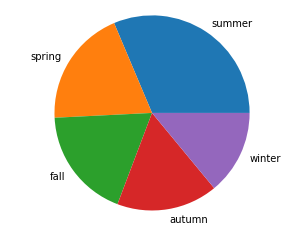
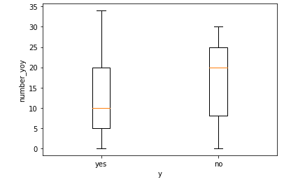

# 정형 데이터의 전처리 1/5

정형 데이터를 처리 방법에 대해 학습합니다. 

<br>

### 데이터 이해

어떤 한 여행사의 주력 패키지 상품이던 하와이 여행 상품이 최근 판매량이 적어 고민입니다. 

여행사는 구매 확률이 높은 고객에게 상품을 추천하는 맞춤형 마케팅을 통해 판매량을 늘리려고 합니다.  

과거에 이 여행사를 통해 여행 상품을 구매한 고객의 데이터를 바탕으로 구매 확률이 높은 사람의 특성을 파악하려 합니다. 

데이터에는 판매하고자 하는 하와이 여행 상품 구매자도 포함되어 있습니다. 

<br>

본격적으로 데이터를 처리하기 전에 데이터와 친해지는 시간을 가집니다. 

데이터의 각 항목이 무엇을 의미하는지 확인합니다. 

age : 나이

job : 직업

contact : 연락 수단

food : 좋아하는 음식

beverage : 좋아하는 음료

number_yoy : 연간 여행 횟수

favorite_continent : 선호하는 대륙

prev_destination : 최근 여행한 여행지

season : 선호 여행 계절

destination : 선호 여행지

member : 여행 인원

period : 여행 기간

transport : 이동 수단

budget : 예산

<br>

데이터 분석 목표를 설정합니다.  

하와이 여행 상품 판매를 위해 이전 구매자 데이터 분석합니다. 

새로운 고객이 하와이 여행 상품 계약 유무를 미리 예측합니다. 

어떤 특성을 가진 사람에게 하와이 상품을 홍보를 해야 판매량이 늘어날지 파악합니다. 

하와이 여행 상품 구매자들의 특성을 파악하여 새롭게 리뉴얼 합니다. 

<br>

### 데이터 확인

파일명이 'data'인 csv 파일의 데이터를 주피터 노트에 업로드합니다. 

```python
import pandas as pd
d_df = pd.read_csv('data.csv', sep=',')

d_df.head()
```

Pandas를 pd로 로드합니다. 

read_csv 매서드를 사용하여 데이터 csv 파일을 읽어와 d_df에 저장합니다. 

read_csv 함수의 첫 번째 인자에는 파일명을, 두 번째 인자에는 식별문자를 지정합니다. 

head 매서드를 사용하여 데이터의 앞 부분 5행을 출력합니다. 


<br>

데이터 행수와 열수를 확인합니다. 

```python
print(d_df.shape)
```

shape를 사용해서 데이터의 행수와 열수를 출력합니다. 

```
(3176, 14)
```

데이터는 1376열, 15행으로 구성되어 있습니다. 


<br>

데이터형을 확인합니다. 

```python
print(d_df.dtypes)
```

dtypes를 사용해서 데이터의 각 항목의 형식을 확인합니다. 

결과
```
age                     int64
job                    object
contact                object
food                   object
beverage               object
number_yoy              int64
favorite_continent     object
prev_destination       object
season                 object
destination            object
member                float64
period                  int64
transport              object
budget                  int64
dtype: object
```

수치 중에서 정수를 포함한 항목은 Int, 소수를 포함한 항목은 Float, 문자열을 포함한 항목은 Object로 확인할 수 있습니다. 

<br>

데이터의 결손값 유무를 확인합니다.  

데이터에 결손값이 존재하면 추후 처리와 분석을 할 때 다양한 문제가 발생할 수 있습니다. 

문제를 해결하기 전에 우선 데이터의 결손값이 어떻게 구성되어 있는지 자세하게 알아봅시다. 

```python
print(d_df.isnull().any(axis=1))
```
isnull을 이용해서 데이터에 결손값 유무를 확인합니다. 

any(axis=1)을 사용해 행 방향 결손값 유무를 확인합니다. 

```
0       False
1       False
2       False
3       False
4       False
        ...  
3171    False
3172    False
3173    False
3174    False
3175    False
Length: 3176, dtype: bool
```

각 행의 결손값 유무를 확인할 수 있습니다. 

```python
print(d_df.isnull().any(axis=0))
```

any(axis=0)을 사용해 열 방향에 결손값이 있는지 확인합니다. 

```
age                   False
job                   False
contact               False
food                   True
beverage              False
number_yoy            False
favorite_continent    False
prev_destination      False
season                False
destination            True
member                 True
period                False
transport             False
budget                False
dtype: bool
```

각 열의 결손값 유무를 확인할 수 있습니다. 

food, destination, member 항목에 결손값이 존재합니다. 

<br>

결손값 개수 파악합니다. 

```python
print(d_df.isnull().sum(axis=1))
```

sum(axis=1)을 사용해 행 방향의 결손값의 개수를 파악합니다. 

```
0       0
1       0
2       0
3       0
4       0
       ..
3171    0
3172    0
3173    0
3174    0
3175    0
Length: 3176, dtype: int64
```

각 행의 결손값 개수를 확인할 수 있습니다.

```python
print(d_df.isnull().sum(axis=0))
```

sum(axis=0)를 이용하여 각 열의 결손값 개수를 확인합니다. 

```
age                     0
job                     0
contact                 0
food                  142
beverage                0
number_yoy              0
favorite_continent      0
prev_destination        0
season                  0
destination           236
member                 33
period                  0
transport               0
budget                  0
dtype: int64
```

각 열의 결손값 개수를 확인할 수 있습니다. 

위와 같이 정렬하면 어떤 항목에 결손값이 많이 있는지 쉽게 파악할 수 있습니다. 

period 항목의 결손 데이터는 458건으로 가장 많은 결손값을 가지고 있습니다. 

<br>

### 통계량 확인

데이터의 전체적인 모양을 확인했다면 이제 데이터를 통해 각종 통계량을 알아보려 합니다. 

앞서 데이터의 형식이 수치인 항목과 문자열인 항목을 확인했습니다. 

데이터형에 따라 통계량을 계산하는 방법과 그 결과 값이 다릅니다. 

<br>

이제 데이터 항목마다 통계량을 확인해 봅니다. 

우선 수치 데이터의 통계량을 계산해 봅시다. 

```python
d_df.describe()
```

describe를 사용해 데이터의 각 항목의 통계량을 계산합니다. 


데이터와 대표값으로 이루어진 표를 통해 통계량을 확인할 수 있습니다. 

count(건수) : 데이터의 건수

mean(평균값) : 데이터의 값을 모두 합해 데이터의 건수로 나눈 값

std(표준편차) : 데이터의 분포를 표현한 값

min(최솟값) : 데이터의 값 중에서 제일 작은 값

25%(제1사분위값) : 전체 데이터를 오름차순으로 나열한 후 4등분 하였을 때, 25% 지점

50%(제2사분위값) : 전체 데이터를 오름차순으로 나열한 후 4등분 하였을 때, 50% 지점

75%(제3사분위값) : 전체 데이터를 오름차순으로 나열한 후 4등분 하였을 때, 75% 지점

max(최댓값) : 데이터의 값 중에서 제일 큰 값

<br>

다음으로 문자열 데이터의 통계량을 확인합니다. 

```python
d_df.describe(include=[object])
```


문자열의 통계량도 확인할 수 있습니다. 

unique(고유값 개수) : 고유한 데이터 값의 개수

top(최빈값) : 데이터 중 가장 많이 출현한 값의 개수

freq(빈도수) : 데이터 중 가장 많이 출현한 데이터의 빈도수

<br>

### 데이터 시각화

데이터를 수치로 그리고 표로 나타내어 보았지만 한눈에 모든 데이터를 확인하기에는 한계가 있습니다.  

그래서 이번에는 데이터 시각화를 통해 데이터를 확인해보려 합니다. 

데이터를 시각화하면 많은 양의 데이터를 한번에 확인하기 편하고, 다양하게 활용이 가능합니다. 

<br>

파이썬 기반 시각화 라이브러리인 Matplotlib을 이용하여 데이터를 시각화 하고 그 분포를 확인하려 합니다. 

Matplotlib을 이용하면 산포도, 막대그래프, 히스토그램 등 다양한 종류로 그래프를 그릴 수 있습니다. 

목표와 결과물에 따라 적절한 그래프를 이용하면 됩니다. 

<br>

데이터형이 수치인 항목의 히스토그램을 작성해보겠습니다. 

```python
import matplotlib.pyplot as plt
%matplotlib inline

plt.hist(d_df['age'])
plt.xlabel('age')
plt.ylabel('freq')
plt.show()
```

Matplotlib을 plt로 로드합니다. 

matplotlib.pyplot 모듈의 hist() 함수를 이용하여 데이터의 age 히스토그램을 사용합니다. 

히스토그램은 도수분포표를 그래프로 나타낸 것으로서, 가로축은 나이 계급, 세로축은 횟수나 갯수를 나타냅니다. 

계급은 변수의 구간이며 서로 겹치지 않습니다. 


나이는 20대가 가장 많고, 10대, 70대 순으로 분포 되어 있습니다. 

<br>

```python
plt.hist(d_df['number_yoy'])
plt.xlabel('number_yoy')
plt.ylabel('freq')
plt.show()
```


연간 여행 횟수는 10회 미만, 17회 이상 20회 미만, 25회 이상 27회 미만에서 높은 수치를 보여줍니다. 

<br>

```python
plt.hist(d_df['member'])
plt.xlabel('member')
plt.ylabel('freq')
plt.show()
```


여행 인원수의 분포도 확인할 수 있습니다. 

<br>

```python
plt.hist(d_df['period'])
plt.xlabel('period')
plt.ylabel('freq')
plt.show()
```


여행 기간은 위와 같이 확인할 수 있습니다. 

<br>

```python
plt.hist(d_df['budget'])
plt.xlabel('budget')
plt.ylabel('freq')
plt.show()
```


예산 분포는 위와 같다는 것을 알 수 있습니다. 

<br>

이처럼 데이터를 표나 수치가 아닌 그래프로 확인을 해 보니 데이터의 분포를 한 눈에 확인할 수 있습니다.

<br>

다음은 산포도 작성 및 두 개 항목의 관련성 확인과 분석을 진행하겠습니다. 

데이터 하나하나의 분포를 확인하는 것도 중요하지만 산포도 그래프를 이용하여 두 개 항목의 관련성을 파악해 이상치의 유무나 상관관계를 시각적으로 음미하는 것이 중요합니다. 

<br>

산포도 그래프는 관련성에는 피어슨 상관계수를 사용합니다. 

피어슨 상관계수는 두 변수간의 선형관계 밀접도를 알려주는 역할로, 변수들이 흩어진 정도를 수치화해서 관련정도를 측정하는 통계량입니다. 

상관계수는 -1 부터 1 사이의 값으로 절댓값이 클 수록 두 항목의 관련성이 강하고, 0에 가까울 수록 관련성이 적습니다. 

상관계수의 값이 양의 값이면 두 항목은 비례 관계이고, 음의 값이면 반비례 관계입니다. 

상관관계가 매우 높은 변수들이 서로 강하게 상관하면 공신성이 발생합니다. 

공신성은 모델의 성능 저하, 불안정 등 다양한 문제를 일으킵니다. 

이와 같은 문제를 방지하기 위해 데이터 준비 단계에서 상관이 강한 변수를 제외하면 됩니다. 

<br>

산포도 그래프를 작성해보겠습니다. 

나이와 여행 횟수에 대한 관련성을 알아보겠습니다. 

```python
plt.scatter(d_df['age'], d_df['number_yoy'])

plt.xlabel('age')
plt.ylabel('number_yoy')
plt.show()

print(d_df[['age', 'number_yoy']].corr())
```

scatter를 사용해서 데이터의 산포도를 작성합니다. 

corr를 이용해서 각 데이터 사이의 상관계수를 계산합니다. 


age와 number_yoy항목의 산포도를 확인해봅니다. 

상관계수 0.441393만큼 관련성이 있습니다. 

<br>

나이와 여행 인원에 대한 관련성을 확인해 보겠습니다. 

```python
plt.scatter(d_df['age'], d_df['member'])

plt.xlabel('age')
plt.ylabel('member')
plt.show()

print(d_df[['age', 'member']].corr())
```


<br>

나이와 여행 기간에 대한 관련성을 확인해 보겠습니다. 

```python
plt.scatter(d_df['age'], d_df['period'])

plt.xlabel('age')
plt.ylabel('period')
plt.show()

print(d_df[['age', 'period']].corr())
```


<br>

나이와 여행 예산에 대한 관련성을 확인해 보겠습니다. 

```python
plt.scatter(d_df['age'], d_df['budget'])

plt.xlabel('age')
plt.ylabel('budget')
plt.show()

print(d_df[['age', 'budget']].corr())
```


<br>

여행 횟수와 여행 인원에 대한 관련성을 확인해 보겠습니다. 

```python
plt.scatter(d_df['number_yoy'], d_df['member'])

plt.xlabel('number_yoy')
plt.ylabel('member')
plt.show()

print(d_df[['number_yoy', 'member']].corr())
```


<br>

여행 횟수와 여행 기간에 대한 관련성을 알아보겠습니다. 

```python
plt.scatter(d_df['number_yoy'], d_df['period'])

plt.xlabel('number_yoy')
plt.ylabel('period')
plt.show()

print(d_df[['number_yoy', 'period']].corr())
```


<br>

여행 횟수와 예산 항목의 관련성을 확인해 보겠습니다. 

```python
plt.scatter(d_df['number_yoy'], d_df['budget'])

plt.xlabel('number_yoy')
plt.ylabel('budget')
plt.show()

print(d_df[['number_yoy', 'budget']].corr())
```


<br>

여행 인원과 여행 기간에 대한 관련성을 알아보겠습니다. 

```python
plt.scatter(d_df['member'], d_df['period'])

plt.xlabel('member')
plt.ylabel('period')
plt.show()

print(d_df[['member', 'period']].corr())
```


<br>

여행 인원과 예산의 관련성을 확인해 보겠습니다. 

```python
plt.scatter(d_df['member'], d_df['budget'])

plt.xlabel('member')
plt.ylabel('budget')
plt.show()

print(d_df[['member', 'budget']].corr())
```


<br>

여행 기간과 예산의 관련성을 확인해 보겠습니다. 

```python
plt.scatter(d_df['period'], d_df['budget'])

plt.xlabel('period')
plt.ylabel('budget')
plt.show()

print(d_df[['period', 'budget']].corr())
```


<br>

### 원 그래프 작성

문자열 항목의 원 그래프 작성 후 분포를 확인하겠습니다. 

우선, 문자열 데이터 항목의 값별로 비율을 계산합니다. 

```python
print(d_df['job'].value_counts(ascending=False, normalize=True))
```

value_counts 매서드를 사용해 발생 횟수를 카운드 합니다. 

ascending=False는 수치를 내림차순으로 정렬하고, normalize=True를 이용해 발생횟수의 합이 1이 되도록 정규화 합니다. 

```
student        0.257557
bank clerk     0.130038
engineer       0.120277
farmer         0.077141
designer       0.055101
baker          0.051008
driver         0.048489
auther         0.042821
firefighter    0.035264
doctor         0.033060
nurse          0.031801
dentist        0.030227
model          0.029912
lawyer         0.029912
fisherman      0.026763
chef           0.000630
Name: job, dtype: float64
```

<br>

데이터의 job 항목의 값들을 비율로 계산했으니 이제 위의 수치를 이용하여 원그래프를 그려보겠습니다. 

```python
job_label = d_df['job'].value_counts(ascending=False, normalize=True).index
job_vals = d_df['job'].value_counts(ascending=False, normalize=True).values

plt.pie(job_vals, labels=job_label)
plt.axis('equal')
plt.show()
```

pie를 이용해 원 그래프를 작성합니다. 


직업들이 분포 되어 있는 것을 확인할 수 있습니다. 

위와 같은 방법으로 다른 문자열 데이터의 원그래프도 그려 분포를 확인합니다. 

<br>

연락 수단에 대한 분포를 확인합니다. 

```python
x = 'contact'

print(d_df[x].value_counts(ascending=False, normalize=True))

x_label = d_df[x].value_counts(ascending=False, normalize=True).index
x_vals = d_df[x].value_counts(ascending=False, normalize=True).values

plt.pie(x_vals, labels=x_label)
plt.axis('equal')
plt.show()
```


이메일, 편지, 전화 골고루 분포되어 있습니다. 

<br>

선호하는 음식에 대한 분포를 확인합니다. 

```python
x = 'food'

print(d_df[x].value_counts(ascending=False, normalize=True))

x_label = d_df[x].value_counts(ascending=False, normalize=True).index
x_vals = d_df[x].value_counts(ascending=False, normalize=True).values

plt.pie(x_vals, labels=x_label)
plt.axis('equal')
plt.show()
```


스시의 비율이 많습니다. 

<br>

선호하는 음료의 분포를 확인합니다.

```python
x = 'beverage'

print(d_df[x].value_counts(ascending=False, normalize=True))

x_label = d_df[x].value_counts(ascending=False, normalize=True).index
x_vals = d_df[x].value_counts(ascending=False, normalize=True).values

plt.pie(x_vals, labels=x_label)
plt.axis('equal')
plt.show()
```


오렌지 주스의 비율이 많습니다. 

<br>

선호하는 대륙의 분포를 확인합니다. 

```python
x = 'favorite_continent'

print(d_df[x].value_counts(ascending=False, normalize=True))

x_label = d_df[x].value_counts(ascending=False, normalize=True).index
x_vals = d_df[x].value_counts(ascending=False, normalize=True).values

plt.pie(x_vals, labels=x_label)
plt.axis('equal')
plt.show()
```


North America의 비율이 많습니다. 

<br>

이전 여행지에 대한 비율을 확인합니다. 

```python
x = 'prev_destination'

print(d_df[x].value_counts(ascending=False, normalize=True))

x_label = d_df[x].value_counts(ascending=False, normalize=True).index
x_vals = d_df[x].value_counts(ascending=False, normalize=True).values

plt.pie(x_vals, labels=x_label)
plt.axis('equal')
plt.show()
```


하와이의 비율이 많습니다. 

<br>

선호하는 계절에 대한 비율을 확인합니다. 

```python
x = 'season'

print(d_df[x].value_counts(ascending=False, normalize=True))

x_label = d_df[x].value_counts(ascending=False, normalize=True).index
x_vals = d_df[x].value_counts(ascending=False, normalize=True).values

plt.pie(x_vals, labels=x_label)
plt.axis('equal')
plt.show()
```



겨울은 fall과 autumn의 두 가지 방법으로 표현되어 있습니다. 

<br>

가고 싶은 여행지에 대한 분포를 확인합니다. 

```python
x = 'destination'

print(d_df[x].value_counts(ascending=False, normalize=True))

x_label = d_df[x].value_counts(ascending=False, normalize=True).index
x_vals = d_df[x].value_counts(ascending=False, normalize=True).values

plt.pie(x_vals, labels=x_label)
plt.axis('equal')
plt.show()
```


가고 싶은 여행지는 위와 같이 골고루 분포되어 있는 것을 확인할 수 있습니다. 

<br>

선호하는 이동 수단의 비율을 확인합니다. 

```python
x = 'transport'

print(d_df[x].value_counts(ascending=False, normalize=True))

x_label = d_df[x].value_counts(ascending=False, normalize=True).index
x_vals = d_df[x].value_counts(ascending=False, normalize=True).values

plt.pie(x_vals, labels=x_label)
plt.axis('equal')
plt.show()
```


비행기를 타고 이동 하는 것을 선호하는 사람들의 비율이 많다는 것을 확인합니다. 

<br>

### 목적변수 데이터 분포 확인

하외이 여행 상품 구매자와 구매하지 않은 사람을 구분할 수 있는 목적변수가 필요합니다. 

y와 n 두 가지 값만을 가지는 목적변수 항목을 새롭게 만들어 줍니다. 

```python
d_df['y'] = ["y" if p=='Hawaii of USA' else "n" for p in d_df['prev_destination']] 
```

prev_destination 항목에서 Hawaii of USA 값을 가지는 데이터는 y로, 나머지는 n로 지정하는 'y'라는 이름의 새로운 항목을 만듭니다. 

이제 y는 데이터 세트의 목적변수에 해당합니다. 

<br>

y의 원그래프를 그려 분포를 확인합니다. 


하와이 여행 상품을 구매한 구매자보다 구매하지 않은 고객이 적은 불균형한 데이터임을 확인할 수 있습니다. 

<br>

모델 작성에 사용하는 데이터는 균형 잡힌 데이터가 이상적입니다. 

만약 불균형한 데이터를 사용하며 다수 클래스터밖에 검출 되지 않는 모델이 만들어 질 것 입니다. 

<br>

목적변수 y에 대한 상자수염그림 그래프 작성 후 데이터의 분산 상태를 확인해 보겠습니다.

```python
y_yes = d_df[d_df['y'] == 'y']
y_no = d_df[d_df['y'] == 'n']

y_age = [y_yes['age'], y_no['age']]

plt.boxplot(y_age)

plt.xlabel('y')
plt.ylabel('age')
ax = plt.gca()

plt.setp(ax, xticklabels = ['yes','no'])
plt.show()
```

목적변수 y가 y인 데이터를 y_yes에, n인 데이터를 y_no에 저장하고, 각각의 age를 결합해서 y_age에 저장합니다. 

<br>

boxplot 메서드를 이용해서 상자수염 그래프를 그립니다. 


박스 안의 빨간선이 데이터의 중앙치, 상하선이 각각 데이터의 제3분위수, 제1분위수 입니다. 

상자 위로 뻗은 수염이 데이터의 최대치, 아래로 뻗은 선이 데이터의 최소치 입니다.

하와이 여행 상품 구매 유무의 목적변수 y와 나이의 데이터는 서로 골고루 분포 되어 있는 것을 확인할 수 있습니다. 

<br>

위와 같은 방법으로 다른 수치 데이터와 목적변수 y와의 데이터 분포를 확인하여 봅시다. 

```python
y_yes = d_df[d_df['y'] == 'y']
y_no = d_df[d_df['y'] == 'n']

y_number_yoy = [y_yes['number_yoy'], y_no['number_yoy']]

plt.boxplot(y_number_yoy)

plt.xlabel('y')
plt.ylabel('number_yoy')
ax = plt.gca()

plt.setp(ax, xticklabels = ['yes','no'])
plt.show()
```



<br>

```python
y_yes = d_df[d_df['y'] == 'y']
y_no = d_df[d_df['y'] == 'n']

y_budget = [y_yes['budget'], y_no['budget']]

plt.boxplot(y_budget)

plt.xlabel('y')
plt.ylabel('budget')
ax = plt.gca()

plt.setp(ax, xticklabels = ['yes','no'])
plt.show()
```


<br>

상자수염 그래프를 이용하여 데이터 분산상태를 알아보았습니다. 