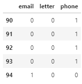
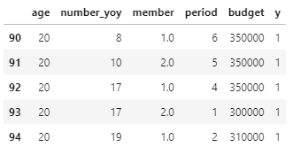

# 정형 데이터의 전처리 2/5

이전 강의에서 이해하고 분석한 데이터의 성질을 바탕으로 데이터를 가공하고 정형하여 알고리즘 모델에 사용할 수 있게 전처리를 진행합니다. 

<br>

우선 데이터의 행수, 열수, 그리고 각 항목의 데이터형을 다시 한번 확인합니다. 

```python
import pandas as pd
d_df = pd.read_csv('data.csv', sep=',')

d_df.head()

print(d_df.shape)
print(d_df.dtypes)
```

데이터의 행수는 3176, 열수는 14입니다. 

데이터의 행수와 열수를 확인하는 것은 중요합니다. 

각 조작을 실행 한 후에는 항상 확인하는 습관을 들이면 도움이 됩니다. 

<br>

### 결손값 제외

이전 강의에서 데이터의 행과 열에 결손값이 존재한다는 것을 알 수 있었습니다. 

결손값이 기준치 보다 적은 행과 열은 제외하고, 결손값이 기준치 보다 많은 행과 열은 적당한 값으로 보완하여 결손값을 처리하겠습니다. 

<br>

food 항목에 142개, destination 항목에 236개, member 항목에 33개의 결손값이 있습니다. 

결손값이 상대적으로 적은 member 항목은 결손값이 포함되어 있는 행을 삭제하겠습니다. 

데이터 건수가 전체 건수의 1/3 미만이고, 각 항목에 특별한 의미가 있지 않는 한 결손되어 있는 데이터 행을 데이터 세트에서 제외시켜도 괜찮습니다. 

<br>

```python
d_df = d_df.dropna(subset=['member'])

print(d_df.shape)
```

dropna를 이용하여 항목을 지정하여주면, 해당 항목의 결손값이 있는 행을 제외시킵니다. 

```
(3143, 14)
```

실행 후 남은 데이터는 3143행, 14열이 됩니다. 

<br>

### 결손값 보완

결손값을 보완하기 앞서 남아있는 결손값의 상황을 파악하겠습니다. 

```python
print(d_df.isnull().sum(axis=0))
```

```
age                     0
job                     0
contact                 0
food                  141
beverage                0
number_yoy              0
favorite_continent      0
prev_destination        0
season                  0
destination           234
member                  0
period                  0
transport               0
budget                  0
dtype: int64
```

food와 destination 항목에 제외하지 못한 결손값이 포함되어 있는 행이 남아있다는 것을 확인합니다. 

<br>

결손값을 보완하는 방법에는 여러가지가 있습니다. 

데이터형이 수치인 결손값의 경우 0으로 보완, 정수로 보완, 전후의 값으로 보완, 항목의 평균값으로 보완 등 다양한 방법이 있습니다.

문자열인 경우 가장 보편적인 값으로 보완, 결손데이터를 하나의 그룹으로 만들어 보완, 무작위로 값을 선택하여 보완하는 방법이 있습니다. 

food와 destination 항목의 결손값은 unknown 이라는 하나의 그룹을 만들어 보완하겠습니다. 

<br>

period의 결손값은 앞서 확인하였던 항목의 평균값, 14로 대체하여 보완하겠습니다. 

```python
d_df = d_df.fillna({'destination':'unknown'})
d_df = d_df.fillna({'food':'unknown'})

print(d_df.isnull().sum(axis=0))
```

fillna를 이용하여 항목과 보완값을 지정하였습니다. 

```
age                   0
job                   0
contact               0
food                  0
beverage              0
number_yoy            0
favorite_continent    0
prev_destination      0
season                0
destination           0
member                0
period                0
transport             0
budget                0
dtype: int64
```

결손값이 모두 보완된 것을 확인할 수 있습니다. 

<br>

### 특이값(이상치) 제외

이번엔 특이값을 제외해 보도록 하겠습니다. 

현재 사용중인 데이터 세트는 여행사를 이용한 전체 고객의 데이터가 저장되어 있습니다.

판매하려고 하는 하와이 상품의 조건과 맞지 않는 고객은 제외하도록 하겠습니다. 

<br>

나이가 17세이상 100세미만이 아닌행을 삭제하겠습니다.  

```python
d_df = d_df[d_df['age'] >= 17]
d_df = d_df[d_df['age'] < 100]

print(d_df.shape)
```

```
(2871, 14)
```

실행 결과 데이터는 2871행, 14열입니다. 

<br>

### 문자열을 수치로 변환

머신러닝 알고리즘은 주로 수치형 데이터를 사용합니다. 

YES나 NO로 표현된 문자열을 0과 1로 변환합니다. 

하와이 여행 상품 구매 유무의 목적변수 y를 생성하여 y는 1, n는 0으로 만듭니다. 

```python
d_df['y'] = ["y" if p=='Hawaii of USA' else "n" for p in d_df['prev_destination']] 

d_df = d_df.replace('y', 1)
d_df = d_df.replace('n', 0)

d_df.head()
```

replace를 사용해서 y값은 1로, n값은 0으로 치환합니다. 

<br>

다수의 값을 가지는 문자열은 One-Hot 비트 표현을 사용해서 더미 변수화하는 방법으로 변환합니다. 

다수의 값을 가지는 문자열 'job', 'contact',	'food',	'beverage',	'favorite_continent', 'season', 'destination', 'transport' 8개의 항목을 더미 변수화합니다. 

```python
d_df_job = pd.get_dummies(d_df['job'])
d_df_contact = pd.get_dummies(d_df['contact'])
d_df_food = pd.get_dummies(d_df['food'])
d_df_beverage = pd.get_dummies(d_df['beverage'])
d_df_favorite_continent = pd.get_dummies(d_df['favorite_continent'])
d_df_season = pd.get_dummies(d_df['season'])
d_df_destination = pd.get_dummies(d_df['destination'])
d_df_transport  = pd.get_dummies(d_df['transport'])
```

get_dummies를 이용해 데이터에 포함되어 있는 항목들을 더미 변수화합니다.



contact 항목은 위와 같이 더미 변수화 된 것을 확인할 수 있습니다. 

<br>

### 분석 데이터 세트 작성

이제 마지막으로 위와 같이 처리하여 정리한 데이터를 분석 데이터 세트로 완성합니다. 

우선 데이터가 수치인 항목을 꺼내놓습니다. 

```python
tmp1 = d_df[['age', 'number_yoy', 'member', 'period', 'budget', 'y']]

tmp1.head()
```

수치인 항목을 추출해 tmp1에 저장합니다. 



위와 같은 수치 항목 데이터가 저장됩니다. 

<br>

tmp1을 베이스로 더미 변수화한 데이터를 결합하겠습니다. 

```python
tmp2 = pd.concat([tmp1, d_df_destination], axis=1)
tmp3 = pd.concat([tmp2, d_df_job], axis=1)
tmp4 = pd.concat([tmp3, d_df_contact], axis=1)
tmp5 = pd.concat([tmp4, d_df_food], axis=1)
tmp6 = pd.concat([tmp5, d_df_beverage], axis=1)
tmp7 = pd.concat([tmp6, d_df_favorite_continent], axis=1)
tmp8 = pd.concat([tmp7, d_df_season], axis=1)
d_df_new = pd.concat([tmp8, d_df_transport], axis=1)

d_df_new.head()
```

concat을 사용해 두 개의 데이터를 결합합니다. axis=1은 수평으로 결합하기 떄문에 두 개의 데이터 행수가 같아야 됩니다. 

모든 수치 데이터와 데이터 더미가 결합되어 d_df_new에 저장되었습니다. 

<br>

마지막으로 CSV 파일로 결과를 출력하겠습니다. 

```python
d_df_new.to_csv('b-prep.csv', index=False)
```

파일명은 'b-prep.csv'로 노트북과 같은 계층에 저장됩니다.