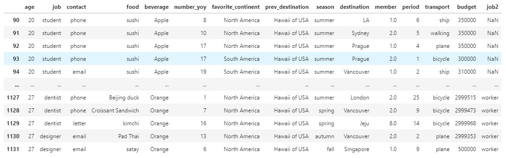
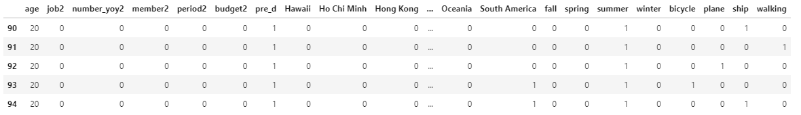

# 정형 데이터의 전처리 4/5

이전과는 다른 좀 더 높은 레벨의 전처리를 위해 데이터를 다시 처리합니다. 

<br>

기존의 변수로 부터 신규변수를 작성하여 처리하겠습니다. 

이 단계를 거치면 목표에 해당되는 결과의 특성 확인 할 수 있습니다. 

예를 들어 계약 확률이 높은 고객을 찾았다면 그 고객의 특성 파악할 수 있습니다. 

하와이 상품이 다시 잘 팔리게 하려면 어떤 부분을 수정해야 하는지 기간, 이동수단, 계절 등 어떤 부분을 조절하면 좋을 지 확인할 수 있습니다. 

<br>

### 다시 데이터 확인

다시 데이터를 처리하기 위해 데이터를 불러옵니다. 

```python
import pandas as pd

d_df = pd.read_csv('data.csv', sep=',')
d_df.head()
```

처음 데이터인 'data.cvs'를 불러옵니다. 

<br>

데이터를 확인합니다. 

```python
print(d_df.shape)
print(d_df.dtypes)
```

데이터의 행수와 열수, 데이터 형을 확인합니다. 

```
(3176, 14)
age                     int64
job                    object
contact                object
food                   object
beverage               object
number_yoy              int64
favorite_continent     object
prev_destination       object
season                 object
destination            object
member                float64
period                  int64
transport              object
budget                  int64
dtype: object
```

데이터는 3176행 14열 입니다. 

<br>

### 결손값 처리

데이터의 결손값을 확인합니다. 

```python
print(d_df.isnull().sum(axis=0))
```

각 행별 데이터 결손값을 개수를 확인합니다. 

```
age                     0
job                     0
contact                 0
food                  142
beverage                0
number_yoy              0
favorite_continent      0
prev_destination        0
season                  0
destination           236
member                 33
period                  0
transport               0
budget                  0
dtype: int64
```

food, destination, member 항목에서 결손값이 있습니다. 

<br>

상대적으로 결손값이 적은 항목의 결손값을 제외합니다. 

```python
d_df = d_df.dropna(subset=['food', 'member'])

print(d_df.shape)
```

food와 member의 결손값 행을 제외 합니다. 

```
(3002, 14)
```

결손값이 포함되어 있는 행을 제외하고 3002행이 되었습니다. 

<br>

결손값을 보완합니다. 

```python
d_df = d_df.fillna({'destination':'unknown'})

d_df.head()
```

destination 항목의 결손값을 unknown로 치환합니다. 


<br>

결손값을 확인합니다. 

```python
print(d_df.isnull().sum(axis=0))
print(d_df.shape)
```

항목 별 결손값과 행,열의 크기를 확인합니다. 

```
age                   0
job                   0
contact               0
food                  0
beverage              0
number_yoy            0
favorite_continent    0
prev_destination      0
season                0
destination           0
member                0
period                0
transport             0
budget                0
dtype: int64
(3002, 14)
```

결손값은 모두 처리되었습니다. 

처리된 데이터는 3002행, 14열입니다. 

<br>

### 이상치 제외

데이터의 이상치를 제외합니다. 

```python
d_df = d_df[d_df['age'] >= 18]
d_df = d_df[d_df['age'] < 100]

print(d_df.shape)
```

나이가 18세 미만, 100세 이상의 특이값을 제외합니다. 

```
(2736, 14)
```

2736행이 되었습니다. 

<br>

### 문자열 값을 통합

문자열 값을 통합하여 새로운 특징량 생성합니다. 

<br>


'job' 항목을 값을 'worker'와 'non-worker'로 나누어 새로운 항목 'job2'를 만들어 값을 통합시킵니다. 

```python
d_df.loc[(d_df['job'] == 'auther') |
         (d_df['job'] == 'baker') |
         (d_df['job'] == 'bank clerk') |
         (d_df['job'] == 'chef') |
         (d_df['job'] == 'dentist') |
         (d_df['job'] == 'designer') |
         (d_df['job'] == 'doctor') |
         (d_df['job'] == 'driver') |
         (d_df['job'] == 'engineer') |
         (d_df['job'] == 'farmer') |
         (d_df['job'] == 'firefighter') |
         (d_df['job'] == 'fisherman') |
         (d_df['job'] == 'lawyer') |
         (d_df['job'] == 'model') |
         (d_df['job'] == 'nurse'), 'job2'] = 'worker'

d_df.head()
```

loc를 사용해서 job 항목에서 해당하는 값을 'worker'로 치환하고 'job2'에 저장합니다. 



'job2'라는 새로운 항목이 생겼고, 해당하는 값이 치환되어 기록되었습니다. 

<br>

'worker'가 아닌 항목 'student'를 'non-worker'로 치환합니다. 

```python
d_df.loc[(d_df['job'] == 'student'), 'job2'] = 'non-worker'

d_df.head()
```


'student' 값을 치환하고 저장하였습니다. 

<br>


`season` 항목을 살펴보면 가을을 나타내는 'fall'과 'autumn'이 각각 다르게 표현되어 있습니다. 

두 항목을 하나로 통합하여 다시 저장합니다. 

```python
d_df.loc[(d_df['season'] == 'fall') |
         (d_df['season'] == 'autumn'), 'season'] = 'fall'

d_df.head()
```

'fall'과 'autumn' 모두 'fall'로 치환하여 기존의 항목 'season'에 통합하여 치환합니다. 

<br>


이전 여행지를 나타내는 'prev_destination' 항목을 하와이와 하와이가 아닌 값으로 통합하여 치환합니다. 

```python
d_df.loc[(d_df['prev_destination'] == 'Hawaii of USA'), 'pre_d'] = 'hawaii'
d_df.loc[(d_df['prev_destination'] != 'Hawaii of USA'), 'pre_d'] = 'Not_hawaii'

d_df.head()
```

'prev_destination' 항목의 값이 'Hawaii of USA'인 경우 'hawaii'로 치환하여 'pre_d' 항목에 저장합니다. 

'prev_destination' 항목의 값이 'Hawaii of USA'가 아닌 다른 값 인 경우 'Not_hawaii'로 치환하여 'pre_d' 항목에 저장합니다. 

<br>

### 수치의 통합

수치의 구간을 정해서 통합하여 치환하여 새로운 특징량을 생성합니다. 

<br>


연간 여행 횟수를 나타내는 'number_yoy'를 통합하여 치환합니다. 

```python
d_df.loc[d_df['number_yoy'] < 25, 'number_yoy2'] = 'short'
d_df.loc[d_df['number_yoy'] >= 25, 'number_yoy2'] = 'long'

d_df.head()
```

'number_yoy 25일을 기준으로 그 보다 적으면 'short' 길면 'long'으로 치환하여 'number_yoy2' 항목을 추가하여 저장합니다. 

<br>

여행 동반 인원을 나타내는 'member'은 평균값인 4를 기준으로 나눕니다. 

```python
d_df.loc[d_df['member'] < 4, 'member2'] = 'few'
d_df.loc[d_df['member'] >= 4, 'member2'] = 'many'

d_df.head()
```

'member'의 값이 4보다 적으면 'few' 많으면 'many'로 치환하여 'member2' 항목에 추가합니다. 

<br>

희망 여행 기간을 나타내는 'period'은 평균값인 8을 기준으로 나눕니다.

```python
d_df.loc[d_df['period'] < 8, 'period2'] = 'short'
d_df.loc[d_df['period'] >= 8, 'period2'] = 'long'

d_df.head()
```

'period'의 값이 8보다 적으면 'short' 많으면 'long'로 치환하여 'period2' 항목에 추가합니다. 

<br>

여행 예산을 나타내는 'budget'은 50000을 기준으로 나눕니다.

```python
d_df.loc[d_df['budget'] < 500000, 'budget2'] = 'less'
d_df.loc[d_df['budget'] >= 500000, 'budget2'] = 'much'

d_df.head(5)
```

'budget'의 값이 500000보다 적으면 'less' 많으면 'much'로 치환하여 'budget2' 항목에 추가합니다.

<br>

### 문자열을 수치로 변환

두 가지 문자열 값으로만 이루어진 항목을 0과 1의 수치로 변환합니다. 

```python
d_df = d_df.replace('hawaii', 1)
d_df = d_df.replace('Not_hawaii', 0)

d_df = d_df.replace('short', 0)
d_df = d_df.replace('long', 1)

d_df = d_df.replace('few', 0)
d_df = d_df.replace('many', 1)

d_df = d_df.replace('less', 0)
d_df = d_df.replace('much', 1)

d_df = d_df.replace('non-worker', 0)
d_df = d_df.replace('worker', 1)

d_df.head()
```



위와 같이 수치로 변환된 값을 확인할 수 있습니다. 

<br>

### 분석한 데이터 세트 작성 및 추가

지금까지 신규로 작성한 변수를 더미변수로 만들어 분석 데이터 세트를 완성하겠습니다. 

<br>

더미 변수를 만들기 위한 목록을 삽입합니다. 

```python
d_df_contact = pd.get_dummies(d_df['contact'])
d_df_food = pd.get_dummies(d_df['food'])
d_df_beverage = pd.get_dummies(d_df['beverage'])
d_df_favorite_continent = pd.get_dummies(d_df['favorite_continent'])
d_df_season = pd.get_dummies(d_df['season'])
d_df_destination = pd.get_dummies(d_df['destination'])
d_df_transport  = pd.get_dummies(d_df['transport'])
```

<br>

수치 항목을 tmp1에 추가합니다. 

```python
tmp1 = d_df[['age', 'job2', 'number_yoy2', 'member2', 'period2', 'budget2', 'pre_d']]

tmp1.head()
```

<br>

더미 변수를 생성합니다. 

```python
tmp2 = pd.concat([tmp1, d_df_destination], axis=1)
tmp3 = pd.concat([tmp2, d_df_contact], axis=1)
tmp4 = pd.concat([tmp3, d_df_food], axis=1)
tmp5 = pd.concat([tmp4, d_df_beverage], axis=1)
tmp6 = pd.concat([tmp5, d_df_favorite_continent], axis=1)
tmp7 = pd.concat([tmp6, d_df_season], axis=1)
d_df_new = pd.concat([tmp7, d_df_transport], axis=1)

d_df_new.head()
```

concat를 이용해 두 개의 데이터를 결합시킵니다. 

<br>

CSV 파일로 저장합니다. 

```python
d_df_new.to_csv('b-prep.csv', index=False)
```

<br>

### 다시 모델 작성

이전과는 조금 달라진 데이터로 다시 한번 Scikit-learn을 이용해 모델을 작성하겠습니다. 

우선 새로운 주피터 노트북을 만들고 처리한 데이터를 불러옵니다. 

```python
import pandas as pd
d_df_new = pd.read_csv('b-prep.csv', sep=',')

d_df_new.head()
```


<br>

RandomOverSampler를 로드하여 랜덤 샘플링을 실행합니다. 


```python
import numpy as np
from imblearn.under_sampling import RandomUnderSampler

X = np.array(d_df_new.drop('pre_d', axis=1))
Y = np.array(d_df_new['pre_d'])

print(np.sum(Y == 1), np.sum(Y == 0))

sampler = RandomUnderSampler(random_state=42)
X, Y = sampler.fit_resample(X, Y)

print(np.sum(Y == 1), np.sum(Y == 0))
```

```
1769 967
967 967
```

하와이 상품 구매자의 데이터와 비구매자의 데이터가 967 건으로 언더샘플링 되어 균일해졌습니다. 

<br>

```python
from sklearn.feature_selection import SelectKBest

selector = SelectKBest(k=5) 
selector.fit(X, Y)
mask = selector.get_support()

print(d_df_new.drop('pre_d', axis=1).columns)
print(mask)
```

특징량을 5개 선택하여 어떤 변수가 영향력 있는지 찾아냅니다. 

```
Index(['age', 'job2', 'number_yoy2', 'member2', 'period2', 'budget2', 'Hawaii',
       'Ho Chi Minh', 'Hong Kong', 'Jeju', 'LA', 'London', 'New York', 'Paris',
       'Prague', 'Singapore', 'Sydney', 'Tokyo', 'Vancouver', 'unknown',
       'email', 'letter', 'phone', 'Beijing duck', 'Chicken Rice',
       'Croissant Sandwich', 'Fish and Chips', 'Gelato', 'Kebob',
       'Masaman Curry', 'Pad Thai', 'Rice Noodles', 'Som Tom', 'bulgogi',
       'green curry', 'ice cream', 'kimchi', 'lasagne', 'nasi goreng', 'ramen',
       'rendang', 'satay', 'sushi', 'tomyumgoong', 'Apple', 'Banana', 'Coffee',
       'Grapefruit', 'Kiwi', 'Mango', 'Orange', 'Strawberry', 'Tomato',
       'Watermelon', 'Africa', 'Antarctica', 'Asia', 'Europe', 'North America',
       'Oceania', 'South America', 'fall', 'spring', 'summer', 'winter',
       'bicycle', 'plane', 'ship', 'walking'],
      dtype='object')
[ True False False  True False False False False False False False False
 False False False False False False False False False False False False
 False False False False False False False False False False False False
 False False False False False False False False False False False False
 False False False False False False False False False  True  True  True
 False False False False False False False False False]
 ```

 위의 결과에서 Ture 값이 나온 변수가 영향력이 있습니다. 

 <br>

 마지막으로 결정트리 모델을 작성해 줍니다. 

 ```python
from sklearn.model_selection import KFold
from sklearn import tree
from sklearn.metrics import accuracy_score

kf = KFold(n_splits=10, shuffle=True)
scores = []
for train_id, test_id in kf.split(X_sel5):
    x = X_sel5[train_id]
    y = Y[train_id]
    clf = tree.DecisionTreeClassifier()
    clf.fit(x,y)
    pred_y = clf.predict(X_sel5[test_id])
    score = accuracy_score(Y[test_id], pred_y)
    scores.append(score)

scores = np.array(scores)
print(scores.mean(), scores.std())
```

```
0.9632952299556647 0.00845802437294304
```

정확도는 0.963... 표준편차는 0.008...입니다. 

<br>

재현율과 적합률을 확인합니다. 

```python
from sklearn.metrics import recall_score
from sklearn.metrics import precision_score

print(recall_score(Y[test_id], pred_y))
print(precision_score(Y[test_id], pred_y))
```

```
0.9306930693069307
0.9791666666666666
```

재현율을 0.930.... 적합률은 0.979...입니다. 

<br>

### 모델의 정밀도 향상

그리드 서치를 실행합니다. 

```python
print(clf)

from sklearn.model_selection import GridSearchCV

params = {
    'criterion': ['entropy'],    
    'max_depth': [2, 4, 6, 8, 10],
    'min_samples_leaf': [10, 20, 30, 40, 50],
}

clf_gs = GridSearchCV(tree.DecisionTreeClassifier(), params, 
                      cv=KFold(n_splits=10, shuffle=True), scoring='accuracy')

clf_gs.fit(X, Y)
```

<br>

가장 높은 정밀도와 패러메터의 조합을 표시합니다. 

```python
print(clf_gs.best_score_)
print(clf_gs.best_params_)
```

위의 결과 값으로 파라미터를 최적화 합니다. 
