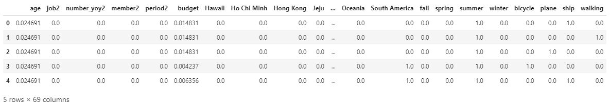
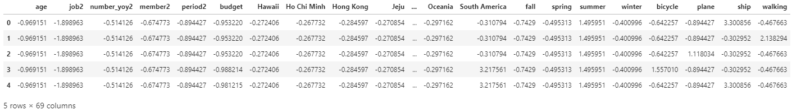
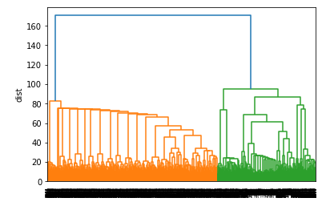
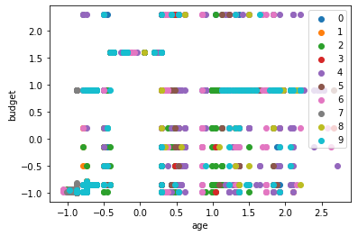
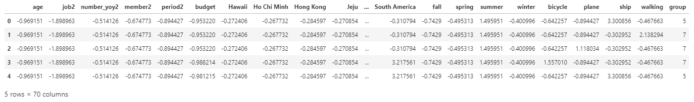
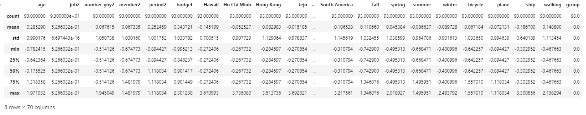

# 정형 데이터의 전처리 5/5

비지도학습 알고리즘을 사용하여 발전된 분석 기법 학습을 알아보겠습니다. 

<br>

머신러닝 학습 방법에는 크게 3가지가 있습니다. 

지도학습

지도학습은 말 그대로 정답이 있는 데이터를 활용해 정답을 알려주며 데이터를 학습시키는 것 입니다. 

대표적으로 분류, 회귀 문제가 있습니다. 

회귀는 데이터의 특징을 기준으로 연속된 값을 예측하는 방법으로, 특정 조건의 주택 가격을 예측하는 문제에서 사용됩니다. 

분류는 데이터를 라벨에 따라 분류하는 방법으로 이진 분류 문제와 다중 분류 문제가 있습니다. 

이진 분류는 스펨메일이 맞다, 아니다 2가지로 분류하는 경우를 말하고, 다중 분류는 2가지 이상으로 분류하는 문제를 말합니다. 

<br>

비지도학습

비지도학습은 지도학습과 다르게 목적 데이터가 없는 학습 방법을 말합니다. 

군집이나 차원 축소와 같은 방법으로 미래를 예측하거나, 정답을 알려주지 않고 비슷한 데이터들을 군집화 하는 것, 그룹핑 알고리즘 등 다양한 방법으로 적절한 특징을 찾아내기 위한 전처리 방법으로 이용됩니다. 

<br>

강화학습

강화학습은 상벌제도를 도입해 보상을 주며 상을 최대화 하고 벌을 최소화 하도록 강화 학습하는 방식입니다. 

주로 게임에서 최적의 동선을 찾는 데 쓰여, 인공지능 바둑 프로그램인 알파고가 이 방식으로 학습되었습니다. 

<br>

그럼 비지도학습 알고리즘을 사용하기 위해 아래의 순서에 따라 진행해주세요. 

<br>

### 데이터 로드

```python
import pandas as pd

d_df = pd.read_csv('b-prep.csv', sep=',')
d_df.head()
```

앞에서 처리를 완료 한 데이터 셋을 불러옵니다. 

<br>

데이터 형태를 확인합니다. 

```python
print(d_df.shape)
print(d_df.dtypes)
```

```
(2736, 70)
age            int64
job2           int64
number_yoy2    int64
member2        int64
period2        int64
               ...  
winter         int64
bicycle        int64
plane          int64
ship           int64
walking        int64
Length: 70, dtype: object
```

데이터는 2861행, 87열 입니다. 

<br>

### 데이터 정규화

서로 다른 데이터간의 비교를 위해 데이터 정규화합니다. 

범위 변환은 최솟값을 0으로, 최댓값을 1로 값을 변경합니다. 

Z 변환은 평균값을 0, 표준편차를 1이 되도록 값을 변환합니다. 

<br>

그럼 범위 변환을 테스트 해 보겠습니다. 

```python
from sklearn.preprocessing import MinMaxScaler

d_df = d_df.drop('pre_d', axis=1)

mc = MinMaxScaler()
mc.fit(d_df)

d_df_mc = pd.DataFrame(mc.transform(d_df), columns=d_df.columns)
d_df_mc.head()
```

Scikit-learn에 포함되어 있는 범위변환 클래스를 로드합니다. 

목적변수 'pre_d'는 범위 변환의 대상이 아니기 때문에 데이터 세트에서 제외합니다. 

MinMaxScaler을 사용해 범위변환용 파라미터를 계산합니다. 

범위변환 결과를 데이터 프레임 형식으로 변환합니다. 



위와 같이 수치가 변환되었습니다. 

<br>

다음은 Z변환 테스트를 진행하겠습니다. 

```python
from sklearn.preprocessing import StandardScaler

sc = StandardScaler()
sc.fit(d_df)

d_df_sc = pd.DataFrame(sc.transform(d_df), columns=d_df.columns)
d_df_sc.head()
```

Scikit-learn에 포함되어 있는 Z변환 클래스를 로드합니다. 

StandardScaler를 사용해 Z변환용 파라미터를 계산합니다. 

Z변환 결과를 데이터 프레임 형식으로 변환합니다. 



위와 같이 Z변환 된 데이터를 확인할 수 있습니다. 

각 항목의 평균과 표준편차를 확인하겠습니다. 

```python
print(d_df_sc.mean())
print(d_df_sc.std())
```

```
age           -1.808170e-16
job2          -2.136368e-15
number_yoy2   -8.122969e-16
member2       -6.006242e-15
period2        2.859636e-15
                   ...     
winter         1.571193e-15
bicycle       -4.988700e-16
plane          1.752984e-17
ship           1.057147e-15
walking       -7.938541e-16
Length: 69, dtype: float64
age            1.000183
job2           1.000183
number_yoy2    1.000183
member2        1.000183
period2        1.000183
                 ...   
winter         1.000183
bicycle        1.000183
plane          1.000183
ship           1.000183
walking        1.000183
Length: 69, dtype: float64
```

실행하면 평균은 '0', 표준편차는 '1'에 가까운 값을 가진다는 것을 확인할 수 있습니다.

<br>

### 고객의 그룹화

고객의 그룹화는 비지도학습 알고리즘을 사용해서 구현합니다. 

비지도학습은 그룹화 기법이 사용되는데 그룹화 기법은 대표적으로 계층형 클러스트링과 비계층형 클러스트링 2가지 기법으로 나뉩니다. 

계층형 클러스트링은 거리가 가까운 데이터부터 순서대로 병합 후 덴드로그램으로 표현됩니다. 

비계층형 클러스터링은 k - Means 법으로 분할하여, 몇 개의 그룹으로 분할할지 갯수정해 그 수만큼 분할을 합니다. 

<br>

계층형 클러스트링을 이용해, 고객을 그룹으로 나누어 보겠습니다. 

```python
from scipy.cluster.hierarchy import linkage, dendrogram
import matplotlib.pyplot as plt
%matplotlib inline

hcls = linkage(d_df_sc, metric='euclidean', method='ward')
dendrogram(hcls)

plt.ylabel('dist')
plt.show()
```

scipy에 포함되어 있는 클러스트링과 덴드로그램을 작성하기 위한 클래스를 로드합니다. 

scipy는 행렬 계산 외에 신호 처리나 통계량의 산출 등과 같은 기능도 제공합니다. 

덴드로그램을 그리기 위한 matplotlib도 불러옵니다. 

데이터 간의 거리는 유클리드 거리로 측정하고, 데이터 병합은 워드법으로 실행하도록 linkage를 사용해 계층형 클러스트링을 실시합니다. 

계층형 클러스트링 결과로부터 덴드로그램을 작성합니다. 



가로축에 고객, 세로축에 거리를 표시하는 다음과 같은 덴드로그램을 확인할 수 있습니다. 

고객별로 어느 그룹에 속해 있는 지 확인하겠습니다. 

```python
from scipy.cluster.hierarchy import fcluster

cst_group = fcluster(hcls, 100, criterion='distance')
print(cst_group)
```

```
[1 1 1 ... 1 1 1]
```

고객의 클러스터 ID가 배열의 형식으로 표시됩니다. 

클러스터 ID는 클러스터 인덱스에 있는 Key 값으로 이 결과를 새로운 특징량으로 사용할 수 있습니다. 

<br>

### 비계층형 클러스트링

비계층형 클러스트링은 K-Means법이 유명합나디. 

K-Means법에서는 데이터의 덩어리를 성질이 비슷한 K개의 덩어리로 분할해 그룹을 형성합니다. 

우선 데이터를 몇 개의 그룹으로 분할할 지 개수를 정해, 그 개수만틈 점을 배치하고 거리를 계산해 그룹을 정합니다. 

그룹내의 데이터 점의 중심 위치를 계산하고 데이터 중심을 그 위치로 이동시킵니다. 

중심 위치가 움직이지 않을 때까지 이 처리를 반복합니다. 

그럼 K-Means법을 이용해서 고객을 그룹으로 분할하겠습니다. 

<br>

K-Means법을 이용한 그룹 분할을 실행합니다. 

```python
from sklearn.cluster import KMeans

kcls = KMeans(n_clusters=10)
cst_group = kcls.fit_predict(d_df_sc)

print(cst_group)
```

데이터를 10개로 분할하는 KMeans 인스턴스를 작성하고 데이터에 대해서 클러스터링을 적용합니다. 

```
[5 7 7 ... 9 9 9]
```

고객의 클러스터가 ID 배열 형식으로 표시됩니다. 

<br>

클러스터 ID 별로 데이터 분포를 확인하겠습니다. 

```python
for i in range(10):
    tmp = d_df_sc[cst_group == i]
    plt.scatter(tmp['age'], tmp['budget'], label=i)

plt.legend()
plt.xlabel('age')
plt.ylabel('budget')
plt.show()
```



클러스터 ID 별로 age와 budget의 산포도를 작성합니다. 

<br>

클러스터 ID는 새로운 특징량으로 사용할 수 있기 떄문에, 원래의 데이터 셋과 결합 시킵니다. 

```python
d_df_sc['group'] = cst_group
d_df_sc.head()
```



데이터 셋에 새로운 항목 'group'가 추가됩니다. 

<br>

그룹별 데이터 건수를 확인합니다. 

```python
print(d_df_sc['group'].value_counts())
```

```
2    609
4    487
1    436
7    362
6    198
9    197
5    186
3    115
0     93
8     53
Name: group, dtype: int64
```

<br>

각 그룹의 통계량을 확인하고 성질을 파악하겠습니다. 

```python
d_df_sc[d_df_sc['group']==0].describe()
```

그룹화 한 데이터의 통계량을 확인하고 각각의 그룹의 성질을 파악합니다. 



위와 같이 확인할 수 있습니다. 

다른 클러스터 ID도 동일한 방법으로 진행하여 확인합니다. 

<br>

### 주성분 분석

주성분 분석(PCA)을 이용한 신규 변수를 작성합니다. 

주성분 분석이란 데이터의 분산이 최대가 되는 방향으로 새로운 축(제 1주성분)을 설정하고, 두 번째로 커지는 방향으로 직교하도록 제 2주성분을 설정한 후 누적기여율을 채워 그 영향력을 계산합니다. 

<br>

PCA를 활용해 신규 변수를 작성해 보겠습니다. 

```python
from sklearn.decomposition import PCA

pca = PCA(0.80)
bank_df_pca = pca.fit_transform(bank_df_sc)

print(pca.n_components_)
print(bank_df_pca.shape)
```

누적 기여율이 80%에 도달할 때 까지 주성분을 추출하는 인스턴스를 생성하고, 데이터 셋에 적용합니다. 

추출한 주성분 수와 적용한 후의 데이터 셋의 크기를 확인합니다. 

```
43
(2736, 43)
```

<br>

다음은 목적변수 별 분포를 확인하겠습니다. 

```python
y = pd.read_csv('b-prep.csv', sep=',')['pre_d']

bank_df_pca = pd.DataFrame(bank_df_pca)
bank_df_pca['pre_d'] = y

print(bank_df_pca.shape)
```

데이터 파일에서 목적변수만 리드합니다. 

차원 압축한 데이터 세트에 목적변수를 추가합니다. 

```
(2736, 44)
```

실행하면 데이터 크기가 2736건, 44열의 항목이 표시됩니다. 

<br>

목적변수별 산포도를 확인합니다. 

```python
import matplotlib.pyplot as plt
%matplotlib inline

bank_df_pca_0 = bank_df_pca[bank_df_pca['pre_d'] == 0]
bank_df_pca_0 = bank_df_pca_0.drop('pre_d', axis=1)
plt.scatter(bank_df_pca_0[0], bank_df_pca_0[1], c='red', label=0)

bank_df_pca_1 = bank_df_pca[bank_df_pca['pre_d'] == 1]
bank_df_pca_1 = bank_df_pca_1.drop('pre_d', axis=1)
plt.scatter(bank_df_pca_1[0], bank_df_pca_1[1], c='blue', label=1)

plt.legend()
plt.xlabel('1st-comp')
plt.ylabel('2nd-comp')
plt.show()
```

목적변수가 0인 제 1주성분와 제 2주성분을 산포도로 작성합니다. 

목적변수가 1인 제 1주성분와 제 2주성분을 산포도로 작성합니다. 


위와 같은 방법으로 다른 주성분의 조합도 확인 해 보세요. 