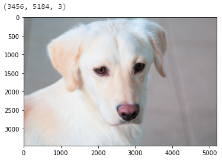
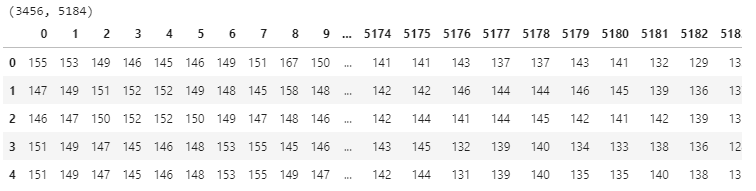

# 이미지 데이터의 전처리 1/3

### 데이터 이해

이미지 데이터를 처리하는 방법에 대해 알아보겠습니다. 

전처리의 목적은 더 나은 방식으로 이미지를 분석할 수 있도록 이미지의 품질을 개선하는 것 입니다. 

컴퓨터는 이미지를 보고 사람처럼 바로 인식하지 못합니ㅏㄷ. 

컴퓨터가 이미지를 인식할 수 있도록 해주는 전처리 과정이 필요합니다. 

다양한 이미지로 학습하는 경우 이미지마다 밝기가 다르고 찍은 환경이 다를 수가 있습니다. 

이것을 어느정도 표준화 과정을 치면 훈련에 사용하기 좋은 데이터가 됩니다. 

전처리를 통해 원하지 않는 왜곡을 억제하고 작업중인 특정 응용 프로그램에 필요한 이부 기능을 향상시킬 수 있습니다. 

예를 들어 

목표는 이미지에 포함되어 있는 피사체를 식별하는 것, 그리고 식별 정확도를 높이는 것으로 하겠습니다. 

데이터 확인 및 분석 목표 확인 

### 데이터 읽기 및 확인

OpenCV를 설치합니다. 

```python
!pip install opencv-python
```

OpenCV(Open Source Computer Vision Libary)를 이용하면 이미지를 다양한 방법으로 처리할 수 있습니다. 

```python
import cv2
import matplotlib.pyplot as plt
%matplotlib inline

img = cv2.imread('dogg (3).jpg')

print(img.shape)

plt.imshow(cv2.cvtColor(img, cv2.COLOR_BGR2RGB))
plt.show()
```

openCV를 불러옵니다. 

imread를 이용해서 이미지를 불러오면 이미지의 BGR(청, 녹, 적)의 순서로 픽셀값이 배열에 저장됩니다. 

shape를 이용해 이미지의 세로축의 크기와 채널수를 확인합니다. 

cvtColor를 이용해 픽셀값의 정렬순을 RGB(적, 녹, 청)으로 바꿔 저장합니다. 

imshow를 이용해 픽셀값을 시각화 합니다. 



귀여운 강아지를 확인할 수 있습니다. 

이미지의 가로 3456, 세로 5184, 컬러 채널은 3번이 된다는 것을 알 수 있습니다. 

<br>

이미지 배열에 저장 된 픽셀 값을 확인해보겠습니다. 

```python
print(img)
```

실행하면 아래와 같은 배열값을 확인할 수 있습니다. 

```
[[[155 146 132]
  [153 144 130]
  [149 140 127]
  ...
  [115 119 120]
  [118 122 123]
  [121 125 126]]]
  ```

<br>

배열의 크기를 확인 해 보겠습니다. 

```python
print(len(img))
print(len(img[0]))
print(len(img[0][0]))
```

배열을 전체 크기를 확인합니다. 

첫 번째 행의 배열 크기를 확인합니다. 

첫 번째 행, 첫 번째 열의 배열 크기를 확인합니다. 

```
3456
5184
3
```

배열의 전체 크기는 3456, 이미지 세로의 크기와 일치합니다. 

첫 번째 행의 배열 크기는 5184, 가로 크기와 일치합니다. 

배열의 크기는 3, 컬러 채널과 일치합니다. 

<br>

### 컬러 이미지

B(청), G(녹), B(적) 각각의 픽셀값을 확인해보겠습니다. 

배열 형식을 데이터 형식으로 표시하겠습니다. 

```python
import pandas as pd

b, g, r = cv2.split(img)

b_df = pd.DataFrame(b)

print(b_df.shape)
b_df.head()
```

split을 이용해서 픽셀을 b, g, r로 분리합니다. 

b(청)에 대한 픽셀값을 b_df에 저장합니다. 



위 처럼 픽셀값을 확인할 수 있습니다. 

개개의 픽셀값은 추후 모델 작성시 특징량으로 사용할 수 있습니다. 

<br>

### 그레이스케일 이미지 

R, G, B의 컬러가 

컬러가 아니고 휘도(밝기의 정도)만 표현하는 이미지

그레이스케일 이미지로 변환

배열에 들어있는 픽셀값 확인

배열의 크기 확인

그레이스케일 이미지의 픽셀값 확인

### 이진화 이미지

그레이스케일 이미지보다 더 정보를 줄여서 특징량만을 돋보이게 한 것

픽셀이 경계값보다 크면 백(255), 작으면 흑(0)으로 변환

이진화 이미지로 변환

이진화 이미지의 픽셀값 확인

데이터 프레임 형식으로 픽셀값 확인